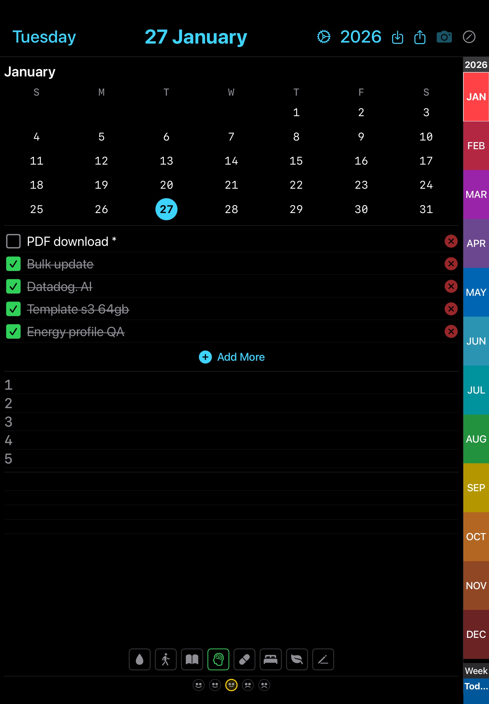
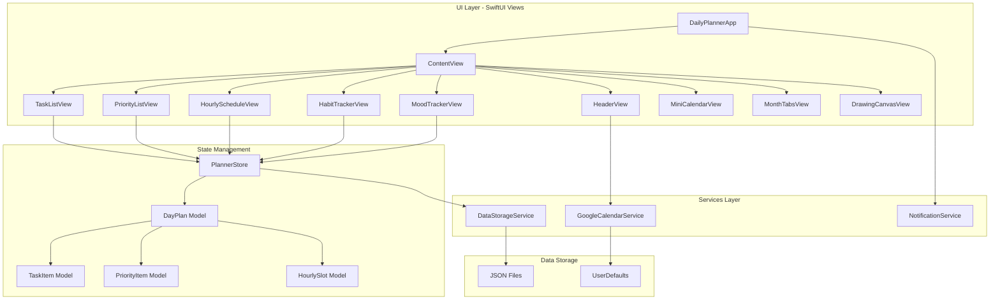

# Daily Planner - iOS/iPadOS Application

A comprehensive daily planning and productivity application built with SwiftUI for iPad and iPhone devices. Features include task management, priority lists, hourly scheduling, habit tracking, mood monitoring, and drawing capabilities.


## 📱 Screenshots


*Daily planner interface with tasks, priorities, hourly schedule, and habit tracking*

## ✨ Features

### Core Functionality
- **📋 Task Management**: Create and manage daily tasks with checkboxes
- **⭐ Priority List**: Track your top 5 priorities for the day
- **⏰ Hourly Schedule**: Plan your day hour-by-hour (10 AM - 11 PM)
- **✅ Habit Tracker**: Monitor 17 daily habits with visual tracking
- **😊 Mood Tracker**: Record your daily mood with 5 emoji options
- **✏️ Drawing Mode**: Annotate and draw over your planner using PencilKit
- **📸 Screenshot Capture**: Save your daily plan to Photos
- **📅 Mini Calendar**: Quick navigation through months and dates
- **📊 Month Tabs**: Visual monthly navigation sidebar

### Data Management
- **💾 Local Persistence**: JSON-based local storage with atomic writes
- **📤 Export**: Share all planner data as a folder via AirDrop, Mail, or Files
- **📥 Import**: Import data from folders or individual JSON files
- **🔄 Cross-Device Sync**: Manual sync between devices using export/import

### Notifications
- **⏰ Hourly Reminders**: Automatic notifications every hour (10 AM - 11 PM)
- **📆 Weekday Only**: Notifications active Monday through Friday
- **⌚ Apple Watch Sync**: Notifications synced to Apple Watch

### Device Optimization
- **📱 iPhone Support**: Optimized UI with keyboard dismissal and smaller fonts
- **📲 iPad Support**: Larger fonts (1.76x scaling) for better readability
- **🎨 Dark Mode**: Native dark mode UI design
- **⌨️ Keyboard Control**: Tap-to-dismiss and Done button for iPhone

## 🏗️ Architecture



## 📁 Project Structure

```
DailyPlanner/
├── DailyPlanner/
│   ├── DailyPlannerApp.swift          # App entry point
│   ├── ContentView.swift              # Main container view
│   ├── Info.plist                     # App configuration
│   │
│   ├── Models/
│   │   └── PlannerData.swift          # Data models (DayPlan, TaskItem, etc.)
│   │
│   ├── Views/
│   │   ├── HeaderView.swift           # Top navigation bar
│   │   ├── TaskListView.swift         # Task list with checkboxes
│   │   ├── PriorityListView.swift     # Priority items (1-5)
│   │   ├── HourlyScheduleView.swift   # Hour-by-hour schedule
│   │   ├── HabitTrackerView.swift     # 17 habit checkboxes
│   │   ├── MoodTrackerView.swift      # 5 mood emoji selectors
│   │   ├── MiniCalendarView.swift     # Mini month calendar
│   │   └── MonthTabsView.swift        # Monthly navigation sidebar
│   │
│   ├── Services/
│   │   ├── DataStorageService.swift   # JSON file I/O
│   │   ├── GoogleCalendarService.swift # OAuth2 & Google API
│   │   └── NotificationService.swift  # Hourly reminders
│   │
│   └── Assets.xcassets/
│       └── AppIcon.appiconset/        # App icons
│
├── DailyPlanner.xcodeproj/            # Xcode project
├── build_ipa.sh                       # IPA build script
├── ExportOptions.plist                # Export configuration
└── README.md                          # This file
```

## 🔧 Technical Stack

### Frameworks & Technologies
- **SwiftUI**: Modern declarative UI framework
- **PencilKit**: Apple Pencil drawing and annotations
- **UserNotifications**: Local notification scheduling
- **Combine**: Reactive state management
- **FileManager**: Local file system operations
- **UIKit Integration**: UIViewControllerRepresentable for share sheets

### Design Patterns
- **MVVM**: Model-View-ViewModel architecture
- **ObservableObject**: State management with Combine
- **Repository Pattern**: DataStorageService abstraction
- **Dependency Injection**: EnvironmentObject for shared state

### Data Persistence
- **Format**: JSON files (one per day)
- **Location**: `Documents/DailyPlanner/yyyy-MM-dd.json`
- **Strategy**: Atomic writes with file protection
- **Encoding**: ISO8601 date format, pretty-printed JSON

## 🚀 Installation & Setup

### Prerequisites
- macOS with Xcode 15.0+
- Apple Developer Account (for device deployment)
- iOS 17.0+ device (iPhone or iPad)

### Build & Deploy

1. **Clone the repository**
```bash
git clone https://github.com/ikppramesh/DailyPlanner.git
cd DailyPlanner
```

2. **Open in Xcode**
```bash
open DailyPlanner/DailyPlanner.xcodeproj
```

3. **Configure Signing**
- Select your development team in Xcode
- Update bundle identifier if needed

4. **Build for Device**
```bash
cd DailyPlanner
xcodebuild -scheme DailyPlanner \
  -destination 'platform=iOS,id=YOUR_DEVICE_ID' \
  -allowProvisioningUpdates \
  build
```

5. **Install to Device**
```bash
xcrun devicectl device install app \
  --device YOUR_DEVICE_ID \
  /path/to/DerivedData/.../DailyPlanner.app
```

### Supported Devices

#### iPad
- iPad Air (5th generation) - 12.9" display
- iPad mini (5th generation) - 7.9" display
- Font scaling: 1.76x for better readability

#### iPhone
- iPhone 15 Pro and newer
- iPhone 14 series
- Smaller font scaling for compact display
- Keyboard dismissal features

## 📖 Usage Guide

### Daily Planning Workflow

1. **Select Date**: Use mini calendar or month tabs to navigate
2. **Add Tasks**: Tap "Add More" to create tasks, check when complete
3. **Set Priorities**: Define your top 5 priorities (numbered 1-5)
4. **Schedule Hours**: Plan each hour from 10 AM to 11 PM
5. **Track Habits**: Check off completed habits throughout the day
6. **Record Mood**: Select your mood emoji at day's end
7. **Annotate**: Enable drawing mode to add notes or highlights
8. **Capture**: Take screenshot to save and share your plan

### Export & Import

#### Export Data (iPad Air example)
1. Tap the **⬇️ Export** button in header
2. Choose sharing method:
   - **AirDrop**: Send directly to another device
   - **Mail**: Email the folder to yourself
   - **Save to Files**: Store in iCloud Drive or locally

#### Import Data (iPad mini example)
1. Receive exported folder via AirDrop or Files
2. Open Daily Planner app
3. Tap the **⬆️ Import** button
4. Select the received folder
5. All days will be imported and current view refreshed

### Keyboard Management (iPhone)

- **Tap Outside**: Tap anywhere outside text fields to dismiss keyboard
- **Done Button**: Use toolbar "Done" button above keyboard
- **Auto-dismiss**: Keyboard closes when navigating away

## ⚙️ Configuration

### Notification Settings

Hourly notifications are configured in `NotificationService.swift`:
- **Time Range**: 10:00 AM - 11:00 PM
- **Days**: Monday - Friday (excludes weekends)
- **Count**: 70 notifications (14 hours × 5 days)

To modify:
```swift
// Change hours: 10-23 (10 AM - 11 PM)
let hours = Array(10...23)

// Change weekdays: 2-6 (Mon-Fri)
let weekdays = Array(2...6)
```

### Font Scaling

Font sizes are device-specific in view files:

**iPad** (1.76x scaling):
```swift
.font(.system(size: UIDevice.current.isIPad ? 33.52 : 13.68))
```

**iPhone** (0.72x of iPad):
```swift
.font(.system(size: UIDevice.current.isIPad ? 33.52 : 13.68))
```

### Data File Format

Each day is stored as JSON:
```json
{
  "date": "2026-01-28T00:00:00Z",
  "tasks": [
    {"id": "...", "text": "Complete project", "isCompleted": true}
  ],
  "priorities": [
    {"number": 1, "text": "Review code"}
  ],
  "hourlySlots": [
    {"hour": 10, "text": "Team meeting"}
  ],
  "completedHabits": [0, 1, 2],
  "selectedMood": 3,
  "drawingData": "<base64 encoded>",
  "notes": ""
}
```

## 🔐 Privacy & Security

- **Local Storage**: All data stored locally on device
- **No Cloud Sync**: Manual export/import only (user controlled)
- **File Protection**: Complete file protection when device locked
- **No Analytics**: No user tracking or data collection
- **No Network**: App works completely offline (except OAuth)

## 🐛 Troubleshooting

### Build Issues

**Problem**: Code signing errors
```
Solution: Select your Apple Developer team in Xcode signing settings
```

**Problem**: Device not found
```
Solution: Ensure device is connected and trusted
Run: xcrun devicectl list devices
```

### Runtime Issues

**Problem**: Keyboard not dismissing on iPhone
```
Solution: Tap outside text field or use "Done" button
Already implemented in latest version
```

**Problem**: Export/Import not working
```
Solution: Grant Files app permissions when prompted
Check Settings > Daily Planner > Files access
```

**Problem**: Notifications not appearing
```
Solution: Check Settings > Notifications > Daily Planner
Ensure notifications are allowed
```

## 🗺️ Roadmap

### Planned Features
- [ ] iCloud CloudKit sync (requires paid developer account)
- [ ] Widget support for iOS home screen
- [ ] Dark/Light theme toggle
- [ ] Custom habit names
- [ ] Week view layout
- [ ] Data analytics and insights
- [ ] Custom notification times
- [ ] PDF export
- [ ] Siri Shortcuts integration
- [ ] Android version (Jetpack Compose)

### Known Limitations
- Personal Apple Developer account (no iCloud sync)
- Manual export/import for cross-device sync
- iPad and iPhone only (no macOS or Apple Watch app)
- English language only

## 📝 Changelog

### Version 1.1.0 (January 30, 2026)
**🔄 Task Rollover Feature**
- Added automatic rollover of incomplete tasks to today's date
- Tasks from previous dates automatically appear on current day when app opens
- Only rolls over tasks with actual text content (ignores empty checkboxes)
- Prevents duplicate tasks with case-insensitive matching
- Rollover happens once per day on first app launch
- Works across all devices (iPad Air, iPad mini, iPhone)

**🐛 Bug Fixes**
- Fixed empty checkbox rollover - now only moves tasks with text
- Improved whitespace trimming for task text validation
- Enhanced duplicate detection with proper text normalization

### Version 1.0.0 (January 28, 2026)
**🎉 Initial Release**
- Complete daily planning interface with tasks, priorities, and hourly schedule
- 17 customizable habits tracking
- 5-level mood tracking system
- PencilKit drawing and annotation support
- Screenshot capture to Photos
- Mini calendar navigation
- Export/Import data functionality via AirDrop, Mail, Files
- Hourly notifications (10 AM - 11 PM, Mon-Fri)
- iPad optimized UI with 1.76x font scaling
- iPhone optimized UI with keyboard dismissal
- Dark mode support
- Local JSON data persistence with atomic writes
- Support for iPad Air 5, iPad mini 5, iPhone 15 Pro

---

## 🤝 Contributing

Contributions are welcome! Please feel free to submit a Pull Request.

1. Fork the repository
2. Create your feature branch (`git checkout -b feature/AmazingFeature`)
3. Commit your changes (`git commit -m 'Add some AmazingFeature'`)
4. Push to the branch (`git push origin feature/AmazingFeature`)
5. Open a Pull Request

## 📄 License

This project is licensed under the MIT License - see the LICENSE file for details.

## 👤 Author

**Ramesh Inampudi**
- Email: ikppramesh@gmail.com
- GitHub: [@ikppramesh](https://github.com/ikppramesh)

## 🙏 Acknowledgments

- Built with SwiftUI and Apple's modern frameworks
- Inspired by bullet journaling and digital planning methodologies
- Thanks to the iOS developer community for best practices

## 📞 Support

For issues, questions, or suggestions:
- Open an issue on GitHub
- Email: ikppramesh@gmail.com

---

**Version**: 1.1.0  
**Last Updated**: January 30, 2026  
**Minimum iOS**: 17.0  
**Tested Devices**: iPad Air 5, iPad mini 5, iPhone 15 Pro
